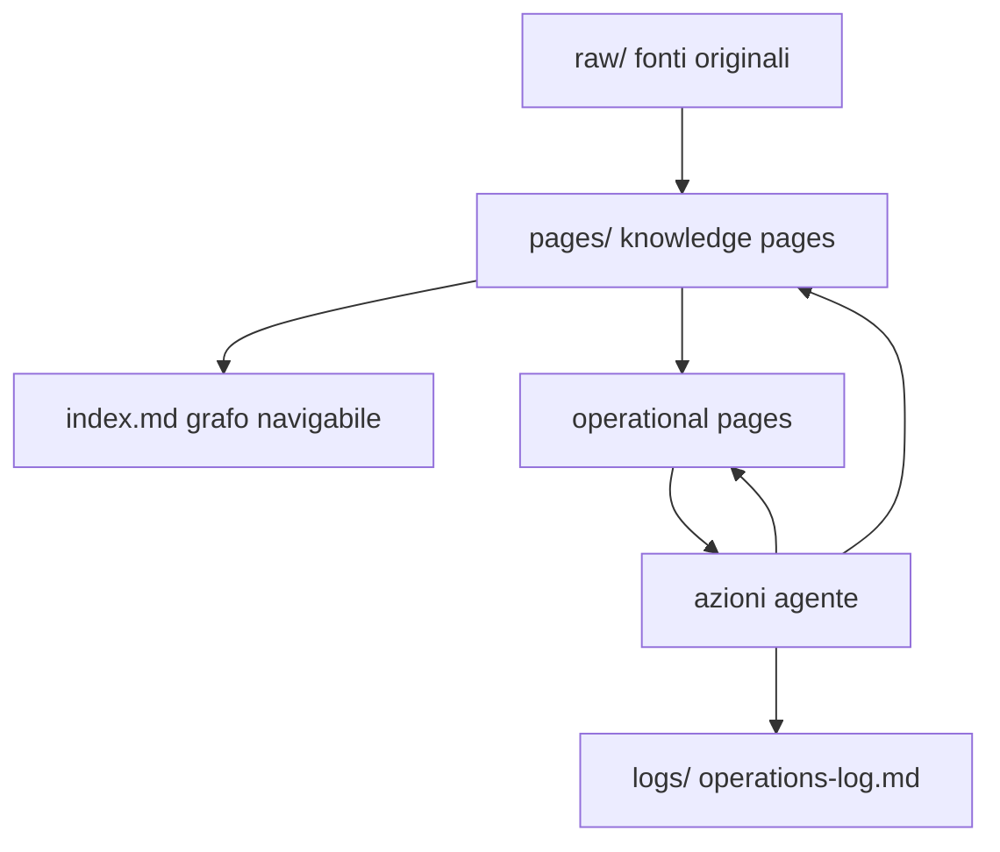

# LLM Wiki Operativa per agenti LLM

Questa cartella contiene una proposta di struttura per usare una LLM Wiki locale come memoria persistente di progetto.

L’idea è ispirata al pattern “LLM Wiki” attribuito ad Andrej Karpathy: invece di interrogare ogni volta i documenti grezzi, l’agente costruisce e mantiene una wiki in Markdown, collegata, incrementale e verificabile.

Questa versione aggiunge una parte operativa: non serve solo a capire il progetto, ma anche a far lavorare agenti diversi senza perdere continuità.

---

## Obiettivo

Creare un unico grafo Markdown che tenga insieme:

- comprensione del progetto;
- stato operativo;
- decisioni;
- task;
- handoff tra modelli;
- fonti originali;
- log delle operazioni.

In pratica:

```text
fonti originali → wiki di conoscenza → stato operativo → azione dell’agente
```

---

## Perché non separare `.ai/` e `wiki/`

Una struttura separata rischia di creare due mondi:

```text
.ai/   → stato operativo
wiki/  → conoscenza del progetto
```

Il problema è che i due mondi possono divergere.

Per questo la soluzione proposta è una sola struttura:

```text
.llm/
```

Dentro `.llm/` tutte le pagine fanno parte dello stesso grafo.

La differenza non è più nella cartella, ma nel ruolo della pagina.

---

## Struttura consigliata

```text
.llm/
├── index.md
├── raw/
├── pages/
│   ├── project-brief.md
│   ├── overview.md
│   ├── architecture.md
│   ├── data-model.md
│   ├── api.md
│   ├── frontend.md
│   ├── backend.md
│   ├── deployment.md
│   ├── security.md
│   ├── current-state.md
│   ├── decisions.md
│   ├── tasks-todo.md
│   ├── session-handoff.md
│   └── open-questions.md
├── logs/
│   └── operations-log.md
└── prompts/
    ├── AI_BOOTSTRAP.md
    ├── AI_WORKFLOW.md
    └── AI_HANDOFF.md
```

---

## Architettura logica



---

## Tipi di pagina

Ogni pagina dovrebbe avere un front matter YAML.

Esempio:

```md
---
type: knowledge-page
role: architecture
update_policy: merge-only
last_verified: 2026-04-25
---
```

Oppure:

```md
---
type: operational-state
role: current-state
update_policy: overwrite-controlled
last_verified: 2026-04-25
---
```

---

## Differenza tra comprensione e azione

### Pagine di comprensione

Servono a spiegare il progetto.

Esempi:

- `project-brief.md`
- `overview.md`
- `architecture.md`
- `data-model.md`
- `api.md`
- `frontend.md`
- `backend.md`
- `deployment.md`
- `security.md`

Queste pagine devono essere stabili, collegate e verificabili.

Non devono diventare un diario della sessione.

---

### Pagine operative

Servono a guidare il lavoro dell’agente.

Esempi:

- `current-state.md`
- `tasks-todo.md`
- `session-handoff.md`
- `open-questions.md`

Devono essere brevi, pratiche e aggiornate.

---

### Pagine append-only

Servono a mantenere memoria storica.

Esempi:

- `decisions.md`
- `operations-log.md`

Non vanno riscritte cancellando la storia.

Se una decisione cambia, si aggiunge una nuova decisione che spiega il cambiamento.

---

## I tre prompt

### 1. `AI_BOOTSTRAP.md`

Serve per inizializzare o aggiornare la struttura `.llm/`.

Quando usarlo:

- all’inizio di un progetto;
- quando importi un progetto esistente;
- quando vuoi creare la prima wiki;
- quando vuoi riallineare la wiki al codice.

Cosa produce:

- struttura `.llm/`;
- pagine base;
- index;
- primo ingest;
- prime domande aperte;
- log iniziale.

Comportamento atteso:

- analizza la cartella;
- non modifica codice sorgente;
- crea pagine Markdown;
- non inventa architettura;
- chiede conferma prima di scrivere, se richiesto dal prompt.

---

### 2. `AI_WORKFLOW.md`

Serve per lavorare quotidianamente sul progetto.

Quando usarlo:

- sviluppo;
- debug;
- refactoring;
- progettazione;
- scrittura documentazione;
- analisi di regressioni;
- aggiunta di funzionalità.

Cosa fa:

- legge la memoria `.llm/`;
- controlla coerenza tra wiki e codice;
- propone un piano;
- lavora rispettando decisioni e architettura;
- aggiorna la wiki dopo le modifiche.

Comportamento atteso:

- non parte alla cieca;
- non reinventa parti già decise;
- aggiorna `current-state.md`, `tasks-todo.md`, `session-handoff.md` e log;
- aggiorna pagine specifiche se il lavoro le impatta.

---

### 3. `AI_HANDOFF.md`

Serve alla fine della sessione.

Quando usarlo:

- prima di chiudere Claude Code, Codex, Gemini CLI o altro agente;
- prima di passare da un modello a un altro;
- dopo modifiche importanti;
- quando vuoi congelare lo stato del progetto.

Cosa produce:

- stato aggiornato;
- task riallineati;
- decisioni registrate;
- handoff leggibile dal prossimo modello;
- log append-only.

Comportamento atteso:

- scrive per un altro modello;
- evita riassunti vaghi;
- segnala cosa non rifare;
- segnala rischi di regressione;
- dichiara lo stato di `architecture.md`.

---

## Uso pratico consigliato

### Primo avvio

1. Copia i tre prompt in `.llm/prompts/`.
2. Apri Claude Code, Codex CLI, Gemini CLI o altro agente.
3. Incolla `AI_BOOTSTRAP.md`.
4. Fai analizzare il progetto.
5. Controlla il riepilogo.
6. Conferma la creazione della struttura.

---

### Sessione normale di lavoro

1. Apri l’agente.
2. Incolla `AI_WORKFLOW.md`.
3. Scrivi il task.
4. Fai proporre un piano.
5. Conferma.
6. Fai lavorare.
7. Pretendi aggiornamento di `.llm/`.

---

### Fine sessione

1. Incolla `AI_HANDOFF.md`.
2. Fai aggiornare stato, task, decisioni e log.
3. Controlla che `session-handoff.md` sia davvero utile.
4. Chiudi la sessione.

---

## Consigli pratici

### 1. Tieni l’index semplice

`index.md` deve essere una mappa, non un romanzo.

Deve permettere a un modello di capire dove andare.

---

### 2. Non trasformare la wiki in un dump

La wiki non deve essere:

```text
file A → riassunto
file B → riassunto
file C → riassunto
```

Deve essere:

```text
componente → responsabilità
flusso → passaggi
decisione → motivo
problema → impatto
```

---

### 3. Proteggi `architecture.md`

È la pagina più pericolosa.

Se l’agente inventa architettura, il progetto deraglia.

Meglio una pagina incompleta ma onesta che una pagina completa ma falsa.

---

### 4. Usa `open-questions.md`

Ogni dubbio deve finire lì.

Un dubbio non scritto viene dimenticato.

---

### 5. Usa `security.md` anche nei piccoli progetti

Annota sempre:

- credenziali;
- file `.env`;
- autenticazione;
- permessi;
- validazione input;
- rischi principali.

Questo è utile soprattutto quando più agenti mettono mano al codice.

---

### 6. Non aggiornare tutto sempre

Aggiorna solo ciò che è impattato.

Se ogni sessione riscrive tutta la wiki, aumenta il rumore.

---

### 7. Usa modelli diversi per compiti diversi

Indicazione pratica:

- Claude: architettura, ragionamento, handoff;
- GPT/Codex: codice, refactoring, test;
- Gemini: lettura ampia e confronto;
- modelli locali: prove rapide, debug, spiegazioni brevi.

Tutti però devono leggere `.llm/index.md` e `.llm/pages/architecture.md` prima di modifiche strutturali.

---

## Checklist finale per ogni sessione

Prima di chiudere, verificare:

- `current-state.md` aggiornato;
- `tasks-todo.md` coerente;
- `session-handoff.md` utile;
- `operations-log.md` aggiornato;
- `decisions.md` aggiornato solo se necessario;
- `architecture.md` aggiornato solo se realmente impattato;
- `open-questions.md` contiene i dubbi ancora aperti;
- `index.md` collega eventuali nuove pagine.

---

## Principio guida

Un solo grafo, due funzioni:

```text
comprensione → sapere come è fatto il progetto
azione → sapere cosa fare adesso
```

La wiki non è solo documentazione.

È la memoria operativa del progetto.
